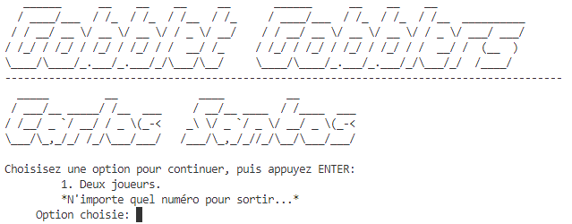
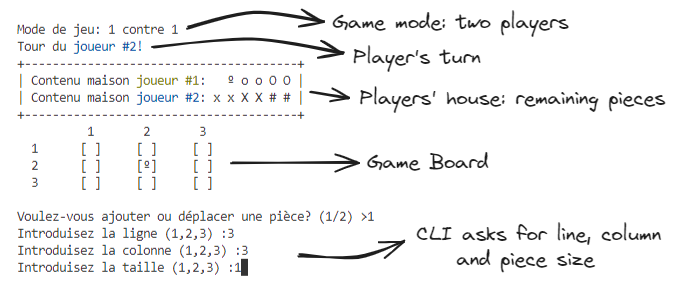
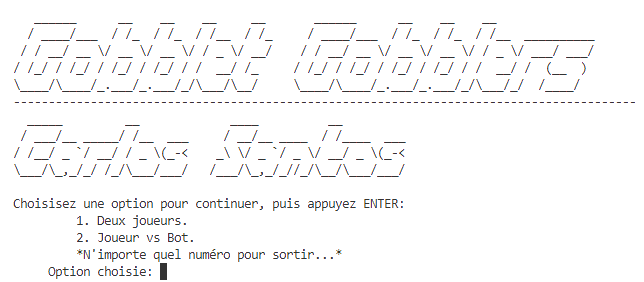
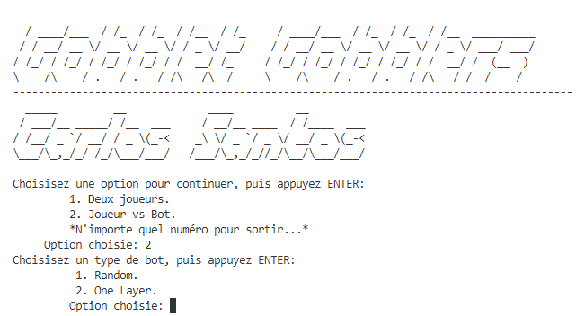

# IMTA-PRASE-GobbletGobblers

<div align="center">


</div>

### About

This repository is an educational purpose software. This software was an Engineering School Project within _Programmation Appliqué Aux Systèmes Embarqués_ subject ([IMT Atlantique](https://www.imt-atlantique.fr/fr), programmed in Semester 5).

_Gobblet Gobblers_ is a variant of the classic Tic-Tac-Toe from [Blue Orange](https://blueorangegames.eu/en/games/gobblet-gobblers). The main difference with Tic-Tac-Toe is you can move your pieces and you can gobble up your opponent's pieces if it is smaller than yours! 

<div align="center">

[](https://www.youtube.com/watch?v=F8F29jfZBRo)

</div>

## Project description

Here are some of the details from our professor to develop our game, based on [UED_projet_Gobblets_2021.pdf](UED_projet_Gobblets_2021.pdf).

> Some pre-compiled implementation of the game module is provided by the professors, in the form of `.o` and `.h` files. A documentation based on the provided header files is available at [html](html) folder. 

### Command-Line Interface (CLI)

> Using the provided `board.o` library, the first step is to **implement your own CLI to play** the game, in `C`. 

### Game Engine in `C++`

> Replacing the provided `board.o` library, the second step is to **implement your own Game Engine** in `C++`. To do this, you must organize your project into classes. The provided `.h` file will help you identify the different classes needed to implement your own game engine.

### Extension - Bot

> To improve your grade, we invite you to **create a bot**, that is to say a program that replaces the player. Ideally, you could offer a version where it is possible to adjust the difficulty of the bot, an easy bot playing almost randomly while a difficult bot will play very cleverly.

## How to use

Linux comes with the GNU `C` compiler preinstalled (if not, you can easily install with `sudo apt install make gcc g++`), which is why I recommend using Ubuntu. 

1. Clone this repo

### a. In order to test the CLI, written in `C`

2. Compile the source code: 
    ```bash
    cd srcC && make
    ```
3. Run the software using `./GobbletGobblers_v1`

    
5. Play !

    

### b. In order to test the Game Engine, written in `C++`

2. Compile the source code: 
    ```bash
    cd srcC++ && make
    ```
3. Run the software using `./GobbletGobblers_v2`

    
4. Play !

### c. In order to play against the Bot, written in `C++`
2. Compile the source code: 
    ```bash
    cd srcC++ && make
    ```
3. Run the software using `./GobbletGobblers_v2`

    
4. Select **2. Jouer vs Bot.**, then select bot type: 
    - _Random_ bot will choose randomly a movement between the legal movements available, 
    - _One Layer_ bot will choose the winning movement, taking account the first of the three layer at the game. 

## Appreciations

We would like to thank the professor of the IMT Atlantique for all their support and for allowing this kind of cool high shool projects. 
